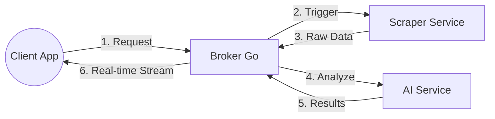

# Price-Wise System: Technical Specification

## 1. Project Overview
Price-Wise is a decoupled microservices-based system designed for real-time e-commerce product analysis. It enables users to search for products across multiple platforms, extract data, analyze them for potential scams and value-for-money, and receive real-time updates.

### Core Components
- **Broker (Go):** The central orchestrator. It manages job states, distributes tasks, and streams results to clients using WebSockets.
- **Scraper (Python/FastAPI):** Extractor service that uses Playwright and Crawl4ai to gather raw product data from e-commerce websites.
- **AI (Python/FastAPI):** Analysis service that employs LightGBM models to evaluate products and detect anomalies or scams.

## 2. Architecture & Data Flow
The system follows an asynchronous, event-driven pipeline:

1.  **Job Initiation:** A client (e.g., Mobile App) sends a search request to the Broker.
2.  **Scraper Activation:** The Broker triggers the Scraper service via a REST call (`POST /scrape`).
3.  **Data Ingestion:** As the Scraper finds products, it pushes raw data back to the Broker (`POST /ingest/raw`).
4.  **AI Analysis:** The Broker batches or streams this raw data to the AI service (`POST /api/v1/analyze`).
5.  **Streaming Results:** The Broker receives analyzed data and sends it to the user in real-time via WebSockets.



## 3. Tech Stack & Requirements

### Broker (brocker-go)
- **Language:** Go 1.24+
- **Key Libraries:** `gorilla/websocket`, `google/uuid`
- **Default Port:** 8000

### Scraper (scraping-python)
- **Language:** Python 3.11+
- **Framework:** FastAPI
- **Libraries:** `playwright`, `crawl4ai`, `uvicorn`
- **Default Port:** 5000 (Expected by Broker)

### AI Service (AI-python)
- **Language:** Python 3.11+
- **Framework:** FastAPI
- **Libraries:** `lightgbm`, `pandas`, `scikit-learn`, `uvicorn`
- **Default Port:** 5001 (Expected by Broker)

## 4. Building and Running

### Running Locally
To run the system locally, you should start the services in the following order:

1.  **AI Service:**
    ```bash
    cd AI-python
    pip install -r requirements.txt
    uvicorn app.main:app --port 5001
    ```
2.  **Scraper Service:**
    ```bash
    cd scraping-python
    pip install -r requirements.txt
    playwright install chromium
    uvicorn scraper_server.main:app --port 5000
    ```
3.  **Broker Service:**
    ```bash
    cd brocker-go
    go run cmd/broker/main.go
    ```
    *Note: Environment variables `AI_URL` and `SCRAPER_URL` can be used to override default service locations.*

### Running with Docker Compose
The easiest way to run the entire system is using Docker Compose. This will build all images, set up a local network, and configure the necessary environment variables for inter-service communication.

```bash
docker-compose up --build
```
This command exposes only the **Broker** on port `8000`. The AI and Scraper services remain internal to the Docker network for security.

### Service Dockerfiles
Each service includes a `Dockerfile`. The `docker-compose.yml` in the root orchestrates these:
- **Broker:** Exposes the system's entry point.
- **AI:** Internal service for processing.
- **Scraper:** Internal service for data extraction.

## 5. Development Conventions
- **Modular Architecture:** Keep business logic in `internal/` (Go) or `app/services/` (Python).
- **Contracts First:** Always update the API models in `pkg/models/message.go` (Go) and their Python equivalents when changing data structures.
- **Environment Variables:**
    - `AI_URL`: Base URL for the AI service (e.g., `http://ai:8000/api/v1`).
    - `SCRAPER_URL`: Base URL for the Scraper service (e.g., `http://scraper:8000`).
    - `BROKER_URL`: Callback URL for the Scraper to send data back (e.g., `http://broker:8000/ingest/raw`).
- **Error Handling:** Use Go `Context` for cancellation and Python's `async/await` with proper exception handling in FastAPI.
- **Testing:** Each service should maintain its own unit tests. (TODO: Standardize testing commands across services).

## 6. Project Structure (High Level)
```text
Price-Wise-system/
├── AI-python/           # ML Analysis Service (FastAPI)
├── brocker-go/          # Orchestration & WebSocket Service (Go)
└── scraping-python/     # Web Scraping Service (FastAPI)
```
Each subdirectory contains its own `GEMINI.md` with service-specific technical details.
